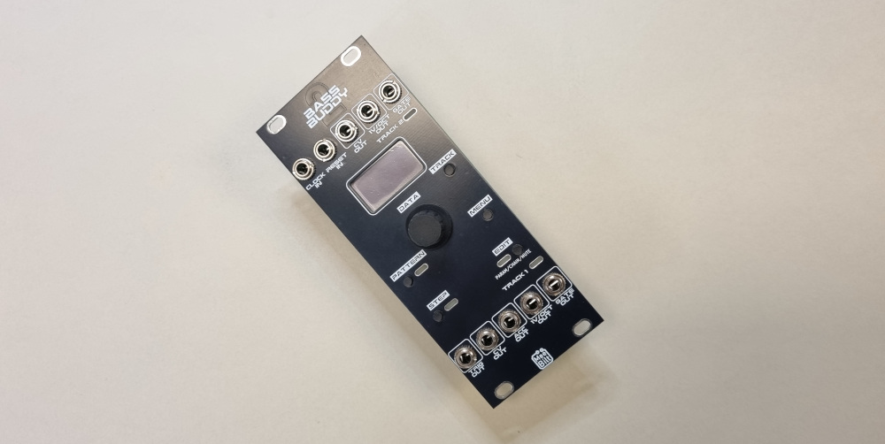

# bb2-sequencer

BassBuddy2 Sequencer is a dual 16-step sequencer for Eurorack. It is designed to be used with the Erica Synths Bassline DIY, but any Eurorack synth-voice can be used.

### Inputs
CLOCK input with 1 clock-pulse per step the advance is made on the low-to-high transition of the signal.  
RESET input which resets the current pattern to step 1 at the low-to-high transition. RESET input can be reconfigured to a Clock for Track2 sequencer.

### Track1 Outputs
GATE output that is held high during the high period of the CLOCK input signal.  
1V/OCT output with note pitch voltage (0.0-4.916V, C-0 to B-4)  
VCF CV output with programmable voltage 0-5V  
ACCENT CV output with programmable 0-5V  
TRIG output programmable 5V pulse 

### Track2 Outputs
GATE output that is held high during the high period of the CLOCK input signal.  
1V/OCT output with note pitch voltage (0.0-4.916V, C-0 to B-4)  
VCF CV output with programmable voltage 0-5V   

### Steps and Patterns
A total of 60 patterns with pattern length 1-16 steps where each step have the following programmable functions:
 - Note pitch (or rest)
 - Tie note to next step
 - Slide to next step
 - VCF CV voltage

### User Interface
Consists of the 0.96" OLED, 5 pushbuttons, 5 LEDs and a rotary encoder with a pushbutton switch.

PATTERN, STEP and EDIT buttons selects and edits patterns. Possible to chain patterns.

TRACK button selects between tracks (sequencer).

MENU button accesses the following functions:
 - NEW: create a new empty pattern
 - SAVE: Save patterns and settings to EEPROM
 - LOAD: Load patterns and settings from EEPROM
 - COPY: Copy pattern
 - CLK:  Configure CLOCK and RESET
 - SEQ:  Set startup pattern after power on
 - CAL:  Calibrate the the dual-PWM outputs
 - TUN1: Output a note on 1V/OCT outputs
 - FACT: Reset patterns and settings to factory settings

### Supply
10-pin power connector:  
+12 VDC @ 60 mA  
-12 VDC @ 10 mA

### Dimensions
Height: 3U  
Width:  10HP  
Depth:  30 mm

### YouTube video
TBA